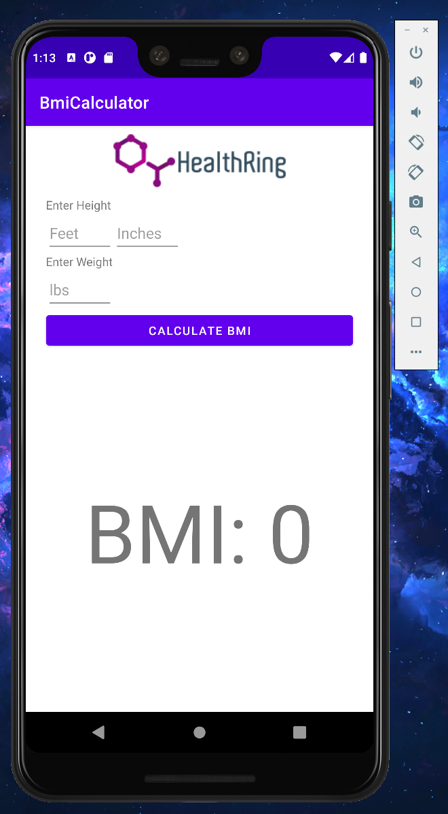

# healthring-group1
healthring-group1-healthring created by GitHub Classroom  
This is a sample project for BMI calculator which could be potentially added to your HealthRing version 2 app.  
It an andriod app developed in Andriod Studio using Kotlin.  
The app simply prompts the user to enter height and weight information into the UI.  
**The formula for the BMI: 703 * Weight / (Height)^2**  
Once entered, the user can press on the "Calculate BMI" button which then  
shows the computed BMI in large text size below that button.  
Below are sample screenshots before  
  
and after.  

